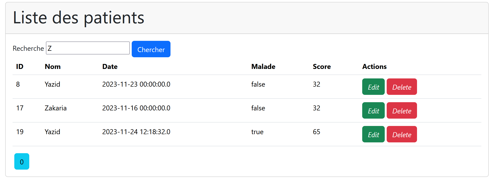

# TP3-4-Hopital-Web

Réalisé par Mohammed Amine Farid

# Rapport du Projet Spring Boot avec Spring Security

# Introduction

Un projet Spring Boot intégrant Spring Security représente une solution robuste pour
le développement d'applications Java sécurisées. Spring Boot, en simplifiant la
configuration et le déploiement, offre une plateforme efficace pour le développement
rapide. L'intégration de Spring Security renforce la sécurité en fournissant des
mécanismes d'authentification et d'autorisation robustes. Cette combinaison permet de
créer des applications web ou microservices avec des fonctionnalités avancées de
gestion des accès, garantissant une protection fiable contre les vulnérabilités de
sécurité.

# Enoncé

Créer une application Web JEE basée sur Spring MVC, Thylemeaf et
Spring Data JPA qui permet de gérer les patients. L'application
doit permettre les fonctionnalités suivantes :

  -  Afficher les patients
  -  Faire la pagination
  -  Chercher les patients
  -  Supprimer un patient
  -  Faire des améliorations supplémentaires

# Projet

## Conception

## Page Web

login:

liste:

Ajout:

search:

edit:

delete:

